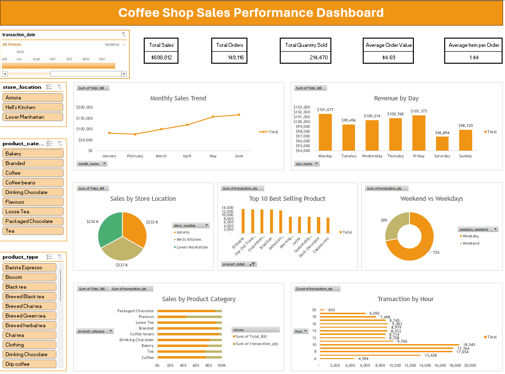

# Coffee Shop Sales Analysis Dashboard Using Excel

## 1. Project Overview
Project ini merupakan analisis data penjualan coffee shop menggunakan Microsoft Excel. Tujuan dari project ini adalah untuk memahami performa penjualan, perilaku pelanggan, performa produk, serta performa setiap cabang melalui proses data cleaning, analisis data, pembuatan KPI, pivot table, dan dashboard interaktif.

Dashboard yang dibuat memungkinkan pengguna untuk memantau metrik bisnis utama dan mengeksplorasi data melalui fitur filter (slicer) untuk mendukung pengambilan keputusan berbasis data.

## 2. Tujuan
Project ini bertujuan untuk:

- Menganalisis performa penjualan coffee shop.
- Mengidentifikasi tren penjualan dari waktu ke waktu.
- Mengetahui produk dan kategori produk dengan performa terbaik.
- Menganalisis perilaku pelanggan berdasarkan hari dan jam transaksi.
- Membandingkan performa antar cabang.
- Menyajikan insight bisnis dalam bentuk dashboard interaktif.

## 3. Tools
- Microsoft Excel (Pivot Table, Pivot Chart, Slicer, Data Cleaning, Dashboard Design)

## 4. Dataset
Dataset yang digunakan adalah Coffee Shop Sales Dataset yang berisi informasi transaksi penjualan, antara lain:

1. `transaction_id` =	ID unik untuk setiap transaksi penjualan.
2. `transaction_date` =	Tanggal terjadinya transaksi.
3. `transaction_time` =	Waktu terjadinya transaksi.
4. `store_id` =	ID unik untuk setiap cabang coffee shop.
5. `store_location` =	Lokasi atau nama cabang tempat transaksi dilakukan.
6. `product_id` =	ID unik untuk setiap produk.
7. `product_category` =	Kategori utama produk, seperti Coffee, Tea, Bakery, dan lainnya.
8. `product_type` =	Jenis produk yang lebih spesifik dalam suatu kategori.
9. `product_detail` =	Nama atau detail produk yang dijual.
10. `size` =	Ukuran produk yang dibeli (Small, Medium, Large, dll.).
11. `transaction_qty` =	Jumlah produk yang dibeli dalam satu transaksi.
12. `unit_price` =	Harga satuan produk.
13. `total_bill` =	Total nilai transaksi yang dihitung dari jumlah produk dikalikan harga satuan.
14. `Month Name` =	Nama bulan yang diekstrak dari kolom transaction_date untuk analisis bulanan.
15. `Day Name` =	Nama hari yang diekstrak dari kolom transaction_date untuk analisis harian.
16. `Hour` =	Jam transaksi yang diekstrak dari kolom transaction_time untuk analisis jam operasional.
    
## 5. Data Cleaning & Preprocessing
Sebelum melakukan analisis dan visualisasi data, dilakukan beberapa tahapan data cleaning dan preprocessing untuk memastikan kualitas data yang digunakan.

1. Data Type Formatting

Beberapa kolom diformat ulang agar sesuai dengan kebutuhan analisis:

1. `transaction_date` =	Diubah ke format Date
2. `unit_price` =	Diubah ke format Currency
3. `total_bill` =	Diubah ke format Currency

2. Missing Value Handling

Dilakukan pemeriksaan missing values pada seluruh kolom dataset dan tidak ditemukan missing values pada dataset.

Dengan demikian, tidak diperlukan proses imputasi maupun penghapusan data akibat nilai yang hilang.

3. Duplicate Data Handling

Dilakukan pemeriksaan data duplikat menggunakan fitur Remove Duplicates pada Microsoft Excel.

Hasil:
- Ditemukan 6 data duplikat
- Sebanyak 6 data duplikat berhasil dihapus
- Dataset akhir berisi 149.117 transaksi unik

Proses ini dilakukan untuk memastikan hasil analisis tidak terdistorsi oleh data yang tercatat lebih dari satu kali.

4. Feature Creation

a. Membuat kolom `Weekend / Weekday`

Kolom `weekend_weekdays` dibuat untuk mengelompokkan transaksi berdasarkan hari kerja dan akhir pekan.

Kolom ini digunakan untuk membandingkan performa penjualan antara hari kerja dan akhir pekan.

## 6. Exploratory Dashboard Analysis
Exploratory Data Analysis (EDA) dilakukan untuk memahami pola data, mengidentifikasi tren penjualan, serta menemukan insight yang dapat mendukung pengambilan keputusan bisnis.

Melalui EDA, data dianalisis dari berbagai perspektif seperti waktu transaksi, lokasi toko, kategori produk, dan perilaku pelanggan.

### Key Performance Indicators (KPIs)

Untuk mengukur performa bisnis secara keseluruhan, dibuat beberapa KPI utama:

1. Total Sales

Mengukur total pendapatan yang dihasilkan dari seluruh transaksi.

Formula:

Total Sales = SUM(`total_bill`)

2. Total Orders

Mengukur jumlah transaksi yang terjadi selama periode analisis.

Formula:

Total Orders = COUNT(`transaction_id`)

3. Total Quantity Sold

Mengukur total produk yang berhasil terjual.

Formula:

Total Quantity Sold = SUM(`transaction_qty`)

4. Average Order Value (AOV)

Mengukur rata-rata nilai transaksi yang dilakukan pelanggan.

Formula:

Average Order Value = Total Sales / Total Orders

5. Average Items per Order

Mengukur rata-rata jumlah produk yang dibeli dalam setiap transaksi.

Formula:

Average Items per Order = Total Quantity Sold / Total Orders

### Sales Analysis
1. Monthly Sales Trend

Analisis ini digunakan untuk melihat perubahan penjualan dari bulan ke bulan.

Business Question: Bagaimana tren penjualan coffee shop selama periode analisis?

2. Sales by Store Location

Analisis ini digunakan untuk membandingkan performa setiap cabang coffee shop.

Business Question: Cabang mana yang menghasilkan pendapatan terbesar?

3. Revenue by Product Category

Analisis ini digunakan untuk mengetahui kategori produk yang memberikan kontribusi revenue terbesar.

Business Question: Kategori produk apa yang paling berkontribusi terhadap pendapatan?

4. Top 10 Best Selling Products

Analisis ini digunakan untuk mengidentifikasi produk yang paling banyak dibeli pelanggan.

Business Question: Produk apa yang paling populer di kalangan pelanggan?

5. Transactions by Hour

Analisis ini digunakan untuk mengetahui jam operasional dengan aktivitas pelanggan tertinggi.

Business Question: Pada jam berapa coffee shop mengalami transaksi terbanyak?

6. Weekend vs Weekday Analysis

Analisis ini digunakan untuk membandingkan performa penjualan antara hari kerja dan akhir pekan.

Business Question: Apakah penjualan lebih tinggi pada weekday atau weekend?

7. Sales by Day Name

Analisis ini digunakan untuk mengetahui hari dengan performa penjualan terbaik.

Business Question: Hari apa yang menghasilkan pendapatan tertinggi?

## 6. Dashboard Development

Dashboard dibangun menggunakan Microsoft Excel dengan memanfaatkan Pivot Table, Pivot Chart, dan Slicer untuk menghasilkan visualisasi yang interaktif.

## 7. Key Insight
Berdasarkan hasil analisis data penjualan Coffee Shop, beberapa insight utama yang diperoleh adalah sebagai berikut:

### 1. Revenue Menunjukkan Tren Pertumbuhan yang Konsisten

Revenue mengalami peningkatan yang signifikan selama periode Januari hingga Juni. Setelah mengalami sedikit penurunan pada Februari, penjualan terus meningkat hingga mencapai puncaknya pada bulan Juni.

- Revenue terendah terjadi pada Februari sebesar $76,145
- Revenue tertinggi terjadi pada Juni sebesar $166,486
- Total revenue meningkat lebih dari dua kali lipat dari Januari hingga Juni

### 2. Hell's Kitchen Menjadi Cabang dengan Performa Terbaik

Analisis berdasarkan lokasi toko menunjukkan bahwa cabang Hell's Kitchen menghasilkan revenue tertinggi dibandingkan cabang lainnya.

- Cabang Hell's Kitchen	= $236,511
- Cabang Astoria	= $232,244
- Cabang Lower Manhattan	= $230,057

Meskipun Hell's Kitchen memiliki revenue tertinggi, perbedaan performa antar cabang relatif kecil sehingga menunjukkan konsistensi operasional yang baik di seluruh lokasi.

### 3. Coffee Menjadi Kategori Produk Terlaris

Kategori Coffee memberikan kontribusi terbesar terhadap total revenue dan jumlah produk terjual.

- Revenue Coffee mencapai $269,952
- Total quantity sold mencapai 89,250 unit
- Coffee menjadi kategori produk paling dominan dibanding kategori lainnya

Kategori Tea juga menunjukkan performa yang sangat baik dan menjadi kontributor revenue terbesar kedua.

### 4. Produk Terlaris Didominasi oleh Varian Kopi

Produk dengan jumlah penjualan tertinggi antara lain:

- Ethiopia
- Our Old Time Diner Blend
- Colombian Medium Roast
- Brazilian
- Jamaican Coffee River

Hal ini menunjukkan bahwa pelanggan memiliki minat yang tinggi terhadap produk kopi premium dan specialty coffee.

### 5. Aktivitas Pelanggan Memuncak pada Jam Pagi

Jumlah transaksi tertinggi terjadi pada rentang waktu 08.00–10.00 dengan puncak transaksi pada pukul 10.00. Hal ini menunjukkan bahwa sebagian besar pelanggan melakukan pembelian sebelum atau saat memulai aktivitas kerja.

### 6. Penjualan Lebih Didominasi oleh Hari Kerja (Weekday)

Analisis menunjukkan bahwa:

- 72% transaksi terjadi pada hari kerja (Weekday)
- 28% transaksi terjadi pada akhir pekan (Weekend)

Hasil ini menunjukkan bahwa coffee shop lebih banyak melayani pelanggan yang beraktivitas pada hari kerja dibandingkan pelanggan akhir pekan.

### 7. Revenue Harian Relatif Stabil

Pendapatan harian berada pada kisaran $96K–$102K dengan performa terbaik terjadi pada hari Jumat.

- Revenue tertinggi: Friday ($101,373)
- Revenue terendah: Saturday ($96,894)

Hal ini menunjukkan bahwa permintaan pelanggan relatif konsisten sepanjang minggu.

## 8. Business Recomendation
Berdasarkan insight yang diperoleh, berikut beberapa rekomendasi yang dapat diterapkan untuk meningkatkan performa bisnis:

### 1. Maksimalkan Penjualan pada Jam Sibuk

Karena sebagian besar transaksi terjadi pada pukul 08.00–10.00, perusahaan dapat memanfaatkan periode ini dengan:

- Menawarkan paket bundling kopi dan pastry
- Menyediakan promo khusus morning coffee
- Mengembangkan program loyalty untuk pelanggan rutin pagi hari
  
### 2. Tingkatkan Performa Penjualan Akhir Pekan

Persentase transaksi pada akhir pekan masih relatif rendah dibandingkan hari kerja.

Beberapa strategi yang dapat diterapkan:

- Promo spesial weekend
- Diskon pembelian keluarga atau grup
- Event komunitas atau live music pada akhir pekan
- Campaign media sosial khusus weekend

### 3. Fokus pada Kategori Produk dengan Kontribusi Tinggi

Kategori Coffee dan Tea merupakan penyumbang revenue terbesar.

Rekomendasi:

- Menambah variasi menu Coffee dan Tea
- Mengembangkan seasonal menu
- Menawarkan menu edisi terbatas untuk meningkatkan minat pelanggan

### 4. Optimalkan Pengelolaan Stok Produk Terlaris

Produk dengan penjualan tertinggi perlu mendapatkan perhatian khusus dalam pengelolaan inventaris.

Langkah yang dapat dilakukan:

- Menjaga ketersediaan stok produk terlaris
- Mengurangi risiko stockout pada jam sibuk
- Menjadikan produk unggulan sebagai fokus promosi
  
### 5. Replikasi Strategi Cabang dengan Performa Terbaik

Cabang Hell's Kitchen menunjukkan performa terbaik dalam menghasilkan revenue.

Rekomendasi:

- Mempelajari faktor keberhasilan cabang tersebut
- Membandingkan pola penjualan antar lokasi
- Mengadopsi strategi yang terbukti efektif ke cabang lainnya
